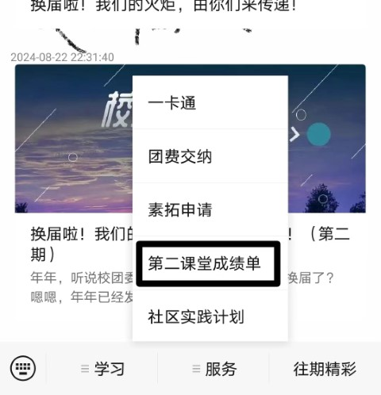

1. **广东财经大学**：官方号，支持一下哈哈哈
2. **广东财经大学财务处**：用于手机端交学费、学分费、住宿费等费用
3. **广东财经大学校园卡**：用于接收有关校园卡使用的通知，宿舍电费水费欠费通知等
4. **广东财经大学校园网**：接收断网通知🤣
5. ⭐**广财青年**：第二课堂的入口（需要校园网 / 校园VPN）
	入口  
	
1. ⭐**广财慕课**：接收相关学习任务、部分老师会用慕课签到
	
	
1. **雨课堂**：好像也是广财慕课的
2. **广财大心理咨询中心**：建议都关注一下~
3. **Hi学生荟**：
	可吃瓜、买卖二手、问答
	
10. **三水运发汽车站**：买校巴的车票